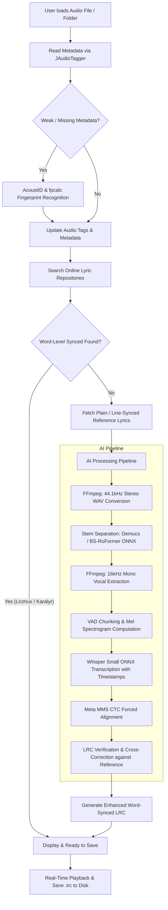

# Karaoke DJ 🎤🎧

[](https://openjdk.org/)
[](https://openjfx.io/)
[](https://spring.io/projects/spring-boot)
[](https://onnxruntime.ai/)
[](LICENSE)

**Karaoke DJ** is a desktop application designed to manage, search, synchronize, and generate high-precision word-by-word karaoke lyrics (**Enhanced LRC format**) for your audio library. 

Combining modern Java technologies with on-device AI models via ONNX Runtime, Karaoke DJ can query online lyric repositories, automatically identify unknown tracks via acoustic fingerprinting, isolate vocal stems from songs, transcribe lyrics using Whisper, align word timings using CTC forced alignment, and verify transcribed text against reference sources.

---

## 📌 Table of Contents
- [What is Karaoke DJ?](#-what-is-karaoke-dj)
- [Key Features](#-key-features)
- [Workflow & Architecture](#-workflow--architecture)
- [Prerequisites & System Requirements](#-prerequisites--system-requirements)
  - [Hardware & Resource Requirements](#hardware--resource-requirements)
  - [Software Dependencies](#software-dependencies)
- [Installation & How to Run](#-installation--how-to-run)
  - [Build and Launch](#build-and-launch)
  - [Configuration & VM Options](#configuration--vm-options)
- [Models & Download Directory](#-models--download-directory)
- [Supported Audio Formats](#-supported-audio-formats)
- [Project Structure](#-project-structure)

---

## 📖 What is Karaoke DJ?

Traditional karaoke creation requires tedious manual timestamping or relies on line-level lyrics that lack word-by-word progression. **Karaoke DJ** automates this entire lifecycle:

1. **Smart Online Retrieval**: First queries online lyric databases for pre-existing word-level karaoke lyrics (Enhanced LRC) or line-level references.
2. **On-Device AI Pipeline**: When no synchronized lyrics exist online, Karaoke DJ separates vocals from instruments, transcribes the voice with speech recognition, and aligns every word to millisecond precision.
3. **Lyric Verification & Cross-Correction**: Combines acoustic timestamps from AI with online textual reference data to fix phoneme/word transcription errors.
4. **Playback & Export**: Provides real-time synchronized playback and one-click `.lrc` export directly alongside your audio files.

---

## ✨ Key Features

- 🎵 **Audio Library & Metadata Management**: Scan individual files or entire folders. Reads and writes ID3/audio tags across multiple formats.
- 🔍 **Acoustic Song Recognition**: Automatically identifies songs with missing or incorrect metadata using Chromaprint (`fpcalc`) and AcoustID fingerprinting.
- 🌐 **Multi-Tier Online Search**:
  - **Word-Level (Enhanced LRC)**: Fetches directly from **Lrcmux** (aggregating KuGou, Musixmatch, NetEase, Genius) and **Karalyr**.
  - **Reference Lyrics**: Queries **LRCLIB** and **Lrcmux** for line-synced or plain text lyrics.
- 🧠 **On-Device Neural Stem Separation**:
  - **HTDemucs v4** (*Fast*): Fast 4-stem separation via ONNX Runtime.
  - **BS-RoFormer** (*High Quality*): High-fidelity 4-stem rhythm separation using host STFT processing.
  - **Vocal-Only Mode**: Option to transcribe pre-isolated vocal WAV files directly without re-separating.
- 🗣️ **Multilingual Speech Recognition (Whisper)**:
  - Powered by **OpenAI Whisper (Small ONNX)** with autoregressive KV-cache decoding and Voice Activity Detection (VAD) chunking.
  - Supported languages: Spanish, English, Portuguese, French, Italian, German, Japanese, and Auto-detection.
- 🎯 **Forced Alignment (MMS-300M CTC)**:
  - Millisecond-accurate word boundaries using Meta's MMS CTC aligner and monotonic Viterbi decoding.
  - Fallback acoustic alignment based on RMS energy dips.
- ⚡ **Low Memory Footprint**:
  - Stream-based audio processing with disk-buffered chunking—the full uncompressed WAV never resides entirely in RAM.
- 🎛️ **Built-in Player**: Play, pause, seek, volume control, and real-time lyric display in a clean JavaFX interface.

---

## 🔄 Workflow & Architecture



### Detailed Pipeline Stages:
1. **Audio Ingestion**: Metadata is extracted. If title/artist tags are missing, AcoustID generates a Chromaprint audio fingerprint to retrieve the official track details.
2. **Repository Search**: The app attempts to download pre-existing word-level karaoke (`.lrc`). If found, it skips the heavy AI pipeline.
3. **Audio Separation**: If AI generation is needed, FFmpeg extracts a 44.1kHz stereo stream. The chosen model (Demucs or BS-RoFormer) separates the mix into `vocal.wav` and `instrumental.wav` via streaming chunks.
4. **Transcription**: The isolated vocal track is converted to 16kHz mono. VAD (Voice Activity Detection) splits speech segments and Whisper Small generates timestamped word tokens.
5. **Alignment & Refinement**: MMS CTC forced alignment locks every character/word boundary precisely to the audio frames.
6. **Cross-Verification**: Transcribed words are compared with the online text reference. Misheard words are substituted with the correct lyrics while preserving exact timing boundaries.
7. **Export**: Generates enhanced LRC format tags `[mm:ss.xx]<mm:ss.xx>word` ready for playback or export.

---

## 💻 Prerequisites & System Requirements

### Hardware & Resource Requirements

| Component | Minimum Requirements | Recommended Requirements |
| :--- | :--- | :--- |
| **RAM** | 4 GB | 8 GB or more |
| **CPU** | Dual-core x86_64 / ARM64 (with AVX2) | Quad-core / 8-threads or higher |
| **GPU (Optional)** | None (runs on CPU) | Dedicated NVIDIA GPU (≥ 2 GB VRAM, CUDA 12 support) / Apple Silicon (M1/M2/M3) |
| **Disk Space** | ~2.5 GB free disk space | 5 GB+ (for model weights & temporary audio cache) |

> [!NOTE]
> - **Memory Efficiency**: Memory consumption is kept under **~1 GB JVM heap** thanks to chunked streaming and ONNX tensor buffer reuse.
> - **GPU Acceleration**: When an NVIDIA GPU with CUDA 12 and cuDNN 9 (or DirectML on Windows, CoreML on macOS) is detected, ONNX Runtime automatically offloads neural inference for 5x–10x faster execution.

### Software Dependencies

1. **Java Development Kit (JDK)**: **Java 25** (or compatible modern OpenJDK).
2. **Apache Maven**: **3.8+** (for building and dependency resolution).
3. **FFmpeg**: Must be installed and accessible from your system `PATH`.
   - **Linux**: `sudo apt update && sudo apt install ffmpeg`
   - **macOS**: `brew install ffmpeg`
   - **Windows**: Install via `winget install Gyan.FFmpeg` or download from [ffmpeg.org](https://ffmpeg.org/) and add to `PATH`.
4. **Chromaprint / fpcalc** *(Optional / Auto-downloaded)*:
   - Used for AcoustID acoustic song recognition.
   - On Linux, can also be installed via `sudo apt install libchromaprint-tools`.

---

## 🚀 Installation & How to Run

### 1. Clone the Repository
```bash
git clone https://github.com/Tomas1201/karaokedj.git
cd karaokedj
```

### 2. Build and Launch

#### Running with Maven (Recommended for Development):
```bash
# Standard run (uses GPU on Windows/Linux if CUDA is available)
mvn clean javafx:run

# Explicit CPU profile (e.g. for macOS or systems without CUDA):
mvn clean javafx:run -Pmac-cpu
```

#### Packaging and Running as a JAR:
```bash
mvn clean package
java -jar target/karaokedj-1.0.0.jar
```

---

### ⚙️ Configuration & VM Options

You can customize runtime behavior by passing Java system properties (`-Dproperty=value`):

| Property | Default | Description |
| :--- | :--- | :--- |
| `-Dia.ort.threads=N` | Dynamic (`2` to `8`) | Number of intra-op threads used by ONNX Runtime for CPU inference. |
| `-Dacoustid.client=KEY` | `""` | Your AcoustID API client key from [acoustid.org](https://acoustid.org/api-key) for track identification. |
| `-Xmx1g` / `-Xmx2g` | `1g` | Maximum JVM Heap size allocation. |

**Example with custom options:**
```bash
mvn javafx:run -Djavafx.args="-Dia.ort.threads=4 -Dacoustid.client=YOUR_ACOUSTID_KEY"
```

---

## 📦 Models & Download Directory

All neural network models are **automatically downloaded on demand** upon first use and cached locally in your home directory:

📍 **Path**: `~/.karaokedj/models/`

| Model | File | Approximate Size | Purpose | Source |
| :--- | :--- | :--- | :--- | :--- |
| **HTDemucs v4** | `htdemucs_fp16weights.onnx` | ~150 MB | Fast vocal/instrumental separation | HuggingFace (`StemSplitio`) |
| **BS-RoFormer** | `bs_roformer_4stem_rhythm_fp16.onnx` | ~300 MB | High-fidelity 4-stem separation | HuggingFace (`silverdaw`) |
| **Whisper Small** | `sherpa-onnx-whisper-small` | ~488 MB | Multilingual speech-to-text | k2-fsa / Sherpa ONNX |
| **MMS Forced Aligner** | `model.q8.onnx` + `vocab.json` | ~340 MB | Millisecond word alignment | HuggingFace (`romara-labs`) |
| **fpcalc** | `fpcalc` | ~10 MB | Chromaprint audio fingerprinting | AcoustID Releases |

---

## 🎧 Supported Audio Formats

Karaoke DJ supports reading metadata and processing the following audio file extensions:
- `.mp3`
- `.flac`
- `.wav`
- `.ogg`
- `.opus`
- `.m4a`
- `.aac`
- `.wma`
- `.aiff`

---

## 📁 Project Structure

```
karaokedj/
├── pom.xml                               # Maven build descriptor with ONNX & JavaFX profiles
├── src/
│   ├── main/
│   │   ├── java/com/karaokedj/
│   │   │   ├── KaraokedjApplication.java # JavaFX Application entry point
│   │   │   ├── SpringBootApp.java        # Spring Boot context initialization
│   │   │   ├── audio/                    # Audio streaming, VAD, STFT/iSTFT, CTC alignment
│   │   │   ├── controller/               # JavaFX UI controllers and cell factories
│   │   │   ├── lyrics/                   # HTTP Providers (LRCLIB, Karalyr, Lrcmux) & AI Pipeline
│   │   │   ├── ml/                       # ONNX Runtime model runners (Demucs, BS-RoFormer, Whisper)
│   │   │   ├── model/                    # Data models (SongMetadata, LrcLyrics, WordTiming)
│   │   │   ├── service/                  # Core services (Separation, Transcription, Verification, Player)
│   │   │   └── util/                     # Timing and memory utilities
│   │   └── resources/
│   │       ├── application.properties    # App configuration & logging rules
│   │       └── fxml/
│   │           └── main_view.fxml        # JavaFX UI layout definition
│   └── test/                             # Unit tests for audio, ML tensors, and services
└── README.md                             # Project documentation
```

---

## 📄 License

This project is licensed under the [MIT License](LICENSE).